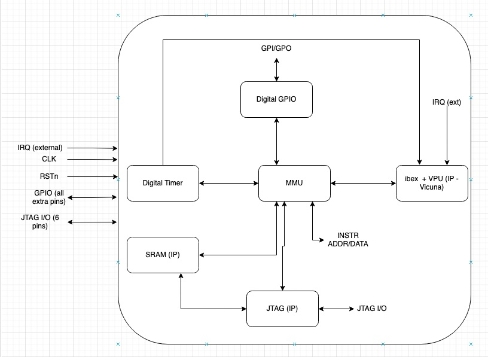
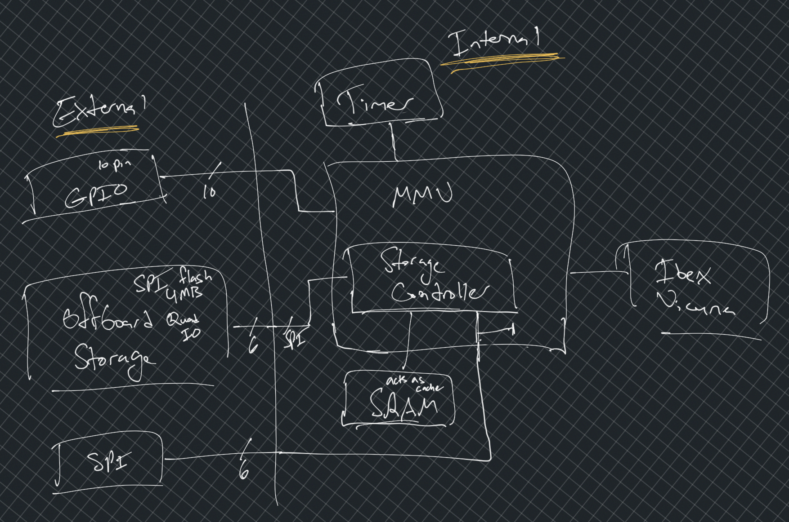

# ece498hk-RISCV-V-Extension

## MMU

External storage will be on SPI flash memory. For example, [this](https://www.mouser.com/ProductDetail/Microchip-Technology-Atmel/SST26VF040AT-104I-SN?qs=vmHwEFxEFR8%252BmQlv%252BpDlqw%3D%3D) 4Mb module. This will only store instructions. It will be seen as read-only by the main core. On chip SRAM will be used as scratch memory. 

External storage is only 24 bit addressable (22 if using aligned which we will be).

External storage will be flashed through our chip. Will have 2 more pins that if shorted on reset will put the chip in programming mode - this is when SPI is connected directly to offboard storage via the storage controller 

Another 2 pins that if shorted on reset will put it into debug mode - this is when addr/data that ibex requests is also outputted via SPI. SRAM can also be dumped in this mode. 

### Memory addresses

| Address Range              | Device                |
| -------------------------- | --------------------- |
| 0x0000_0000 - 0x0000_0100  | Reserved              |
| 0x0000_0101 - 0x0000_010A  | GPIO Pin Set          |
| 0x0000_010B - 0x0000_0114  | GPIO                  |
| 0x0000_0115                | Digital Timer         |
| 0x0000_0116 - 0x0000_0FFF  | Reserved              |
| 0x0000_1000 - 0x0000_1FFF  | SRAM Scratch Memory   |
| 0x0000_2000 - 0x0100_1FFF  | External Storage      |
| 0x0100_2000 - 0xFFFF_FFFF  | Reserved              |

GPIO Pin Set is used to set direction of pins. 0 is default for all pins. 0 = output, 1 = input. If read requested from output pin or write requested from input pin, the vproc_mem_err_i output from MMU is set high for 1 clock cycle. Reading from GPIO Pin Set returns its current state. 

**TODO:** change cache in ibex/vicuna to always fetch for addresses 0x0000_0000-0x0000_0FFF. 

## Divider
Vector division

## SRAM Register File
